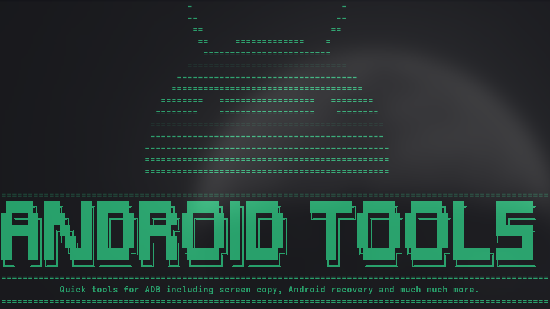
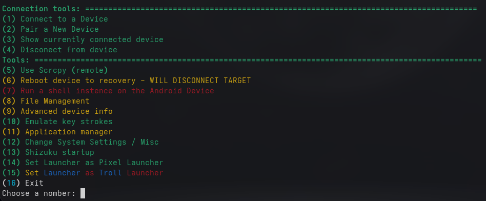
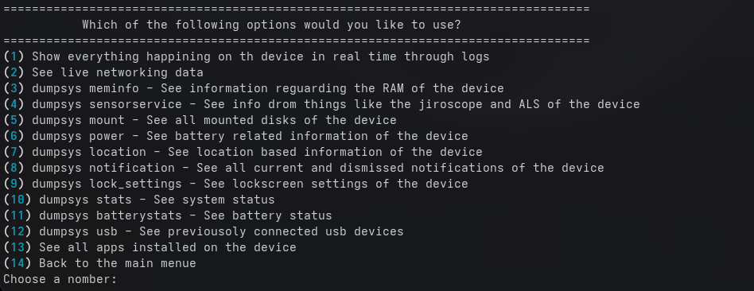
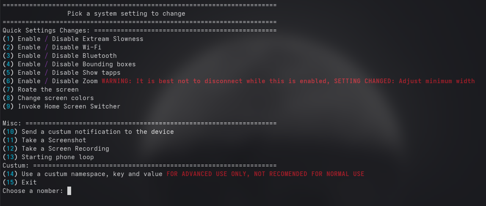

# 
The swiss army knife for all things android.

# ⚠️ IMPORTANT
This tool has some functions that may cause damage to your device, I am not responsible if that happens.

# Download
On Linux:

0. See **IMPORTANT**
1. Run `'git clone https://github.com/S3b-sudo/Android-Tools'` in the terminal or download the code as a zip
2. Run the install file with `'python install.py'`

On Windows:

¯\_(ツ)_/¯
Try it yourself and see what happens, or try WSL.

## Run
 To run the project run `'./run.sh'`

# Scrcpy Manual Install
You can use this if there is a new version of scrcpy.

1. Download the latest release https://github.com/Genymobile/scrcpy/
2. Un-zip the archive in the res folder
3. rename the folder to scrcpy

## Screenshots

All Options

Dumpsys extraction options

Settings manager

#Notes
This is pretty much just a terminal front end for ADB and SCRCPY. 
